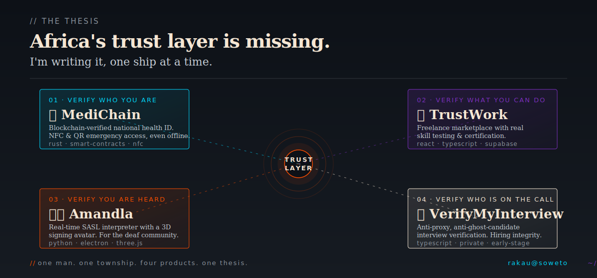
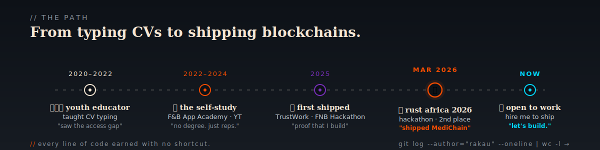

<!-- ═══════════════════════════════════════════════════════════════════════════
     KEORAPETSWE "RAKAU" KGOATLHA
     mrlucas679 · Soweto, Naledi 🇿🇦 · Trust-Layer Engineer
     ═══════════════════════════════════════════════════════════════════════════ -->



<!-- ─── SMALL TYPING LINE ─────────────────────────────────────────────────── -->

<div align="center">

[](https://git.io/typing-svg)

</div>

---

<!-- ═══════════════════════════════════════════════════════════════════════════
     ▶  MANIFESTO · ~/about/why.md
     ═══════════════════════════════════════════════════════════════════════════ -->

<br/>

> They called it the **"CV typing class."**
> I called it the first verification system a township kid ever sees — proof
> that you exist, that you qualify, that you belong in the room.
>
> I watched brilliant minds get filtered out of opportunity because
> **Africa's trust layer doesn't exist yet.** A hospital that can't find your
> records in time. An employer who can't confirm your skills. An interview
> panel that can't tell the candidate from the proxy. A deaf classmate with
> no interpreter in sight.
>
> So I stopped teaching CV layouts and started building the rails underneath.
>
> Soweto taught me that *ubuntu* is a specification.
> Rust taught me that *trust* is a compile-time guarantee.
> A 🥈 silver medal at the **Rust Africa Hackathon 2026** taught me **I can ship**.
>
> I'm **Rakau**. I build in public from Naledi. I'm open to work, and my
> only condition is that we build something that **matters**.

<br/>

---

<!-- ═══════════════════════════════════════════════════════════════════════════
     ▶  THE THESIS · a visual
     ═══════════════════════════════════════════════════════════════════════════ -->



<br/>

---

<!-- ═══════════════════════════════════════════════════════════════════════════
     ▶  NEOFETCH
     ═══════════════════════════════════════════════════════════════════════════ -->



<br/>

---

<!-- ═══════════════════════════════════════════════════════════════════════════
     ▶  WHOAMI — the Rust version
     ═══════════════════════════════════════════════════════════════════════════ -->

### `$ cargo run --bin whoami`

```rust
use africa::trust_layer;

struct Developer<'a> {
    name:       &'a str,
    handle:     &'a str,
    origin:     &'a str,
    thesis:     &'a str,
    shipping:   Vec<(&'a str, &'a str)>,
    awards:     Vec<&'a str>,
    status:     Status,
    mantra:     &'a str,
}

enum Status { OpenToWork, Compiling, Mentoring }

fn main() -> Result<(), Box<dyn std::error::Error>> {
    let rakau = Developer {
        name:     "Keorapetswe Lucas Kgoatlha",
        handle:   "Rakau · @mrlucas679",
        origin:   "Soweto, Naledi 🇿🇦",
        thesis:   "Africa's trust layer is missing. I'm writing it.",
        shipping: vec![
            ("🏥 MediChain",         "verify who you are, in an emergency"),
            ("💼 TrustWork",         "verify what you can actually do"),
            ("🤟🏾 Amandla",           "verify that everyone gets heard"),
            ("🔐 VerifyMyInterview", "verify who's really on the call"),
        ],
        awards:   vec!["🥈 Rust Africa Hackathon 2026 · Finalist"],
        status:   Status::OpenToWork,
        mantra:   "you can never stop learning ♾️",
    };

    trust_layer::ship(&rakau)?;
    // → compiled in 0.42s, shipped with love from Soweto
    Ok(())
}
```

<br/>

---

<!-- ═══════════════════════════════════════════════════════════════════════════
     ▶  THE JOURNEY
     ═══════════════════════════════════════════════════════════════════════════ -->



<br/>

---

<!-- ═══════════════════════════════════════════════════════════════════════════
     ▶  CURRENTLY
     ═══════════════════════════════════════════════════════════════════════════ -->

## <samp>⟢ currently</samp>

<table>
  <tr>
    <td><b>🚧 building</b></td>
    <td><code>MediChain</code> — blockchain-verified national health ID with NFC/QR emergency access. Rust + smart contracts, designed for paramedics with zero signal.</td>
  </tr>
  <tr>
    <td><b>🌱 learning</b></td>
    <td>Distributed systems · Solana · zero-knowledge proofs · African fintech rails</td>
  </tr>
  <tr>
    <td><b>🎯 looking for</b></td>
    <td>A team that ships fast, mentors hard, and builds things Africa actually needs.</td>
  </tr>
  <tr>
    <td><b>⚡ my edge</b></td>
    <td>Empty repo → shipped MVP in &lt; 30 days. Silver medal at Rust Africa 2026 as proof.</td>
  </tr>
  <tr>
    <td><b>🗣️ I speak</b></td>
    <td>English · Setswana · isiZulu — useful when your product ships across African markets</td>
  </tr>
  <tr>
    <td><b>☕ fuel</b></td>
    <td>Rooibos, YouTube tutorials at 1.75×, and the sound of <code>cargo build</code> succeeding</td>
  </tr>
</table>

<br/>

---

<!-- ═══════════════════════════════════════════════════════════════════════════
     ▶  CHANGELOG — my journey
     ═══════════════════════════════════════════════════════════════════════════ -->

## <samp>⟢ my.changelog.md</samp>

```md
## [v2026.04] — current ✦ "ship / repeat"
### Shipped
- 🥈 Rust Africa Hackathon 2026 — Finalist with MediChain
- 🤟🏾 Amandla — real-time SASL avatar for the South African deaf community
- 🏢 Co-founded Lukau Tech Invasion (@LukauTechInvasion)

## [v2025.Q4] — "prove it"
### Shipped
- 💼 TrustWork v1 — marketplace that tests skills, doesn't just rate them
- 🚀 2 hackathons competed · 1 trophy brought home · 0 regrets

## [v2025.Q2] — "the pivot" ◉
### Changed
- ROLE: youth educator → full-stack developer
- LESSON CARRIED OVER: if you can teach a kid to type a CV,
                       you can ship a system that verifies one
### Added
- Rust · React · TypeScript · Supabase to the toolbelt

## [v2022–2024] — "raw reps"
### Added
- Discipline. Thousands of YouTube hours. F&B App Academy.
- Late nights reading std::* documentation until it clicked.
- Zero shortcuts. Zero complaints. Refused to quit.

## [v2020–2022] — "origin"
### Initial Commit
- Born & raised in Soweto, Naledi 🇿🇦
- Taught kids how to type CVs at community centres
- Watched the access gap up close. Decided to do something about it.
```

<br/>

---

<!-- ═══════════════════════════════════════════════════════════════════════════
     ▶  PROJECTS — source of truth
     ═══════════════════════════════════════════════════════════════════════════ -->

## <samp>⟢ ./projects --links</samp>

<div align="center">

<a href="https://github.com/mrlucas679/medichain">
  
</a>
<a href="https://github.com/mrlucas679/amandla">
  
</a>

<a href="https://github.com/mrlucas679/trust-work">
  
</a>
<a href="https://github.com/mrlucas679/trustwork">
  
</a>

</div>

<br/>

---

<!-- ═══════════════════════════════════════════════════════════════════════════
     ▶  TECH ARSENAL
     ═══════════════════════════════════════════════════════════════════════════ -->

## <samp>⟢ ./arsenal --list</samp>

<div align="center">

**Languages & Runtimes**

[](https://skillicons.dev)

**Frameworks & Libraries**

[](https://skillicons.dev)

**Data & Infra**

[](https://skillicons.dev)

**Tools**

[](https://skillicons.dev)

</div>

<br/>

---

<!-- ═══════════════════════════════════════════════════════════════════════════
     ▶  STATS DASHBOARD
     ═══════════════════════════════════════════════════════════════════════════ -->

## <samp>⟢ ./stats</samp>

<div align="center">


<br/>


</div>

<br/>

---

<!-- ═══════════════════════════════════════════════════════════════════════════
     ▶  CONTRIBUTION PULSE
     ═══════════════════════════════════════════════════════════════════════════ -->

## <samp>⟢ ./contributions --last=12months</samp>

[](https://github.com/mrlucas679)

<br/>

---

<!-- ═══════════════════════════════════════════════════════════════════════════
     ▶  SNAKE
     ═══════════════════════════════════════════════════════════════════════════ -->

## <samp>⟢ ./snake --eat-my-commits</samp>

<div align="center">

<picture>
  <source media="(prefers-color-scheme: dark)" srcset="https://raw.githubusercontent.com/mrlucas679/mrlucas679/output/github-snake-dark.svg" />
  <source media="(prefers-color-scheme: light)" srcset="https://raw.githubusercontent.com/mrlucas679/mrlucas679/output/github-snake.svg" />
  
</picture>

</div>

<br/>

---

<!-- ═══════════════════════════════════════════════════════════════════════════
     ▶  WHY ME
     ═══════════════════════════════════════════════════════════════════════════ -->

## <samp>⟢ ./why-me.md</samp>

- 🥈 **Proof, not promises.** Rust Africa Hackathon 2026 · Finalist. I ship under pressure.
- 🏗️ **Range.** Rust backends. React frontends. Three.js avatars. FastAPI services. SQL schemas. I move across the stack without translation overhead.
- 👨🏾‍🏫 **Teacher's communication.** I can explain a linked list to a twelve-year-old *and* hold my own in a design review with a principal engineer.
- 🌍 **African context as a feature.** I understand what it means to build for 3G connections, shared devices, and users who rely on cash-based payment rails.
- 🗣️ **Trilingual.** English · Setswana · isiZulu. Useful the moment your product touches the continent.
- 🎯 **Ready for:** Junior Dev · Graduate Dev · Freelance · Internship.

<br/>

---

<!-- ═══════════════════════════════════════════════════════════════════════════
     ▶  CONNECT
     ═══════════════════════════════════════════════════════════════════════════ -->

## <samp>⟢ ./connect</samp>

<div align="center">

<a href="https://www.linkedin.com/in/keorapetswe-kgo">
  
</a>
<a href="mailto:kkgawatlh9@gmail.com">
  
</a>
<a href="https://github.com/mrlucas679">
  
</a>
<a href="https://github.com/LukauTechInvasion">
  
</a>

<br/><br/>


</div>

<br/>

---

<!-- ═══════════════════════════════════════════════════════════════════════════
     ▶  FOOTER
     ═══════════════════════════════════════════════════════════════════════════ -->

<div align="center">

### <samp>`Motho ke motho ka batho.`</samp>

<sub><i>I am because we are. Build accordingly.</i></sub>

<br/>

<sub>💻 <b>built · broken · fixed · shipped</b> · from <b>Naledi, Soweto</b> with ❤️ · <code>EOF</code></sub>

<br/>


</div>
